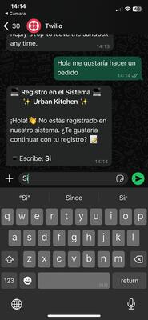
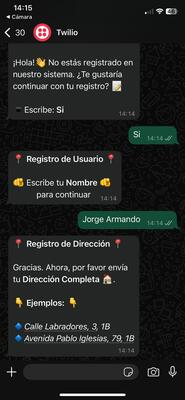
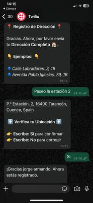
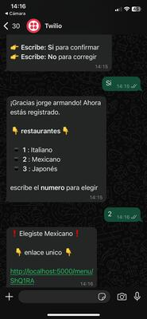

# README - Order Management API with Flask

## Description

This project is an API based on Flask that allows for the management of orders through WhatsApp using the Twilio API. The application receives customer messages via Twilio, registers the user in the database if they are not already registered, and takes their order. It also uses Redis for generating and validating unique links and connects to a database for user and order management.

 ,  , ,  
## Code Flow

### 1. Receiving Messages from WhatsApp

The `/webhook` endpoint receives customer messages through a `POST` request via the Twilio API. It extracts the customer's number (`From`) and the message content (`Body`). The message is then cleaned using the `clean_text` function.

1. If the user is not registered in the database (`verify_user_db`), the `handle_registration` function is called to proceed with their registration.
2. If the user is already registered, the `handle_registered_messages` function is executed to interpret and respond to their message.

### 2. User Registration and Validation

When a new user sends a message, the system:

- Registers the user in the database using `save_user_db`.
- Assigns a status in `user_status` to track their progress in the conversation.

When an existing user interacts, the flow continues depending on the registered status, allowing for personalized responses.

### 3. Order Management

The `/api/add_order` endpoint receives orders in JSON format. The system:

- Iterates over the WhatsApp numbers in the request and their respective products.
- Adds these products to the cart via `cart_instance.add_products`.
- Returns a confirmation in JSON format.

### 4. Generating Unique Links

When a user requests the menu, a unique token is generated using `generate_link`. This token is stored in Redis along with the customer's number.

- If the user accesses `/menu/<token>`, the token is verified in Redis.
- If valid, the user data is retrieved from the database, and the `quiniela.html` template is rendered with the user's information.

### 5. Viewing Orders

The `/orders` endpoint queries the database to retrieve the list of registered orders.

- An SQL query is executed to extract the data ordered by date.
- The results are processed and formatted into a readable JSON.
- The `view_orders.html` template is rendered with the list of orders.

## Notes

- If you need to change the allowed origins for CORS, modify them in `CORS(app, resources={...})`.
- The database must be properly configured to avoid errors when retrieving users or orders.

## Authors

Developed by Jorge Armando Escobar.

